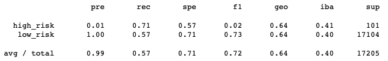

# Credit_Risk_Analysis

## Overview of Analysis

The purpose of this analysis is to train and test models with unbalanced classes. machine learning models will be built and evaluated using several resampling techniques. The accuracy of these models will be evaluated to determine their usefulness at predicting credit risk. 

### Purpose

The purpose of this analysis is to use machine learning to predict credit risk for a peer-to-peer lending company in order to create a quicker, more reliable loan experience and increase identification accuracy of good loan candidates.

## Results

  #### Random Oversampling

  - **Accuracy Score:** 0.67
  - **Precision:**
    - High Risk: 0.01 Low precision results in a large number of false positives.
    - Low Risk: 1.00 
  - **Recall:**  
    - High Risk: 0.74 
    - Low Risk: 0.61 
  - **F1 Score:**
    - High Risk: 0.02, There is an imbalance between sensitivity and precision. 
    - Low Risk: 0.75 
  
#### SMOTE Oversampling

  - **Accuracy Score:** 0.66
  - **Precision:** 
    - High Risk: 0.01, this model is not precise at predicting high risk loans , resulting in many false positives
    - Low Risk: 1.00
  - **Recall:** 
    - High Risk: 0.63 
    - Low Risk: 0.69
  - **F1 Score:**
    - High Risk: 0.02
    - Low Risk: 0.82 
  
#### ClusterCentroids Undersampling  

  - **Accuracy Score:** 0.54, the accuracy of this model is lower the the previous two.
  - **Precision:**
    - High Risk: 0.01 
    - Low Risk: 1.00 
  - **Recall:** 
    - High Risk: 0.40 
    - Low Risk: 0.69 
  - **F1 Score:**
    -  High Risk: 0.01
    -  Low Risk: 0.57 
    -  Both F1 scores decreased compared to the oversampling models.
  
#### SMOTEENN

  - **Accuracy Score:** 0.64
  - **Precision:**
    - High Risk: 0.01  
    - Low Risk: 1.00 
  - **Recall:**
    - High Risk: 0.71  
    - Low Risk: 0.57   
  - **F1 Score:** 
    - High Risk: 0.02 
    - Low Risk: 0.73
    - The Smoteenn model produced results that were very similar to the random oversampling model
  
- **Balanced Random Forest Classifier**

  - **Accuracy Score:** .78, Highest accuracy score of the six models 
  - **Precision:** 
    - High Risk: 0.03 
    - Low Risk: 1.00   
  - **Recall:**
    - High Risk: 0.70 
    - Low Risk: 0.87 
  - **F1 Score:**
    - High Risk: 0.06 
    - Low Risk: 0.93  
  
####  AdaBoost Classifier

  - **Accuracy Score:** 0.69, the accuracy decreased compared to the Balanced Random Forest Classifier F1 score. 
  - **Precision:**
    - High Risk: 0.88, much higher precision at predicting high risk than the other models  
    - Low Risk: 1.00 
  - **Recall:**
    - High Risk: .38 
    - Low Risk: 1.00 
  - **F1 Score:**
    - High Risk: 0.53 
    - Low Risk: 1.00 
    - These are the best F scores of the models tested however the high risk F score is still low. 
  
## Summary
Resampling resulted in low precision for predicting high risks for each of these models. This would cause a large number of false positives indicating unreliable positive classification. The precision greatly improved precision with the EasyEnsembleClassifier model, however, the recall and F1 score was low for predicting high risk. Accuracy was also low for this model. The balancedRandomTreeClassifier had the highest accuracy score of .79, but the precision and F1 score for high risk were very low. 

### Model Recommendation
Each of these models have flaws that will result in unreliable loan classification. Therefore, I would not recommend use of any of these models for prediction of loan risk. 
